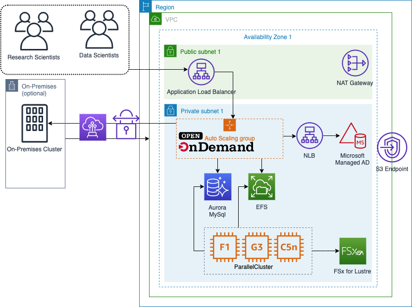

# Open OnDemand on AWS with Parallel Cluster

This reference architecture provides a set of templates for deploying [Open OnDemand (OOD)](https://openondemand.org/) with [AWS CloudFormation](https://aws.amazon.com/cloudformation/) and integration points for [AWS Parallel Cluster](https://aws.amazon.com/hpc/parallelcluster/).

## Architecture

The primary components of the solution are:

1. Application load balancer as the entry point to your OOD portal.
1. An Auto Scaling Group for the OOD Portal.
1. A SimpleAD LDAP Directory
1. A Network Load Balancer (NLB) to provide a single point of connectivity to SimpleAD
1. An Elastic File System (EFS) share for user home directories
1. An Aurora MySQL database to store Slurm Accounting data
1. Automation via Event Bridge to automatically register and deregister Parallel Cluster HPC Clusters with OOD

## Prerequisites

1. Route53 domain for your OOD portal

## Deployment 🚀

1. Launch the stack in your AWS account by clicking on one of the below regions:

| Region           | Launch                                                                                                                                                                                                                                                                                                                           |
|------------------|----------------------------------------------------------------------------------------------------------------------------------------------------------------------------------------------------------------------------------------------------------------------------------------------------------------------------------|
| Ohio (us-east-2) |  |
| N. Virginia (us-east-1) |  |
| Ireland (eu-west-1) |  |
| Frankfurt (eu-central-1) |  |

    
More Regions (Click to expand)

| Region           | Launch                                                                                                                                                                                                                                                                                                                           |
|------------------|----------------------------------------------------------------------------------------------------------------------------------------------------------------------------------------------------------------------------------------------------------------------------------------------------------------------------------|
| Oregon (us-west-2) |  |
| California (us-west-1) |  |
| London (eu-west-2) |  |
| Paris (eu-west-3) |  |
| Stockholm (eu-north-1) |  |
| Middle East (me-south-1) |  |
| South America (sa-east-1) |  |
| Canada (ca-central-1) |  |
| Tokyo (ap-northeast-1) |  |
| Seoul (ap-northeast-2) |  |
| Mumbai (ap-south-1) |  |
| Singapore (ap-southeast-1) |  |
| Sydney (ap-southeast-2) |  |

Once deployed, you should be able to navigate to the URL you set up as a CloudFormation parameter and log into your Open OnDemand portal. You can use the username `Administrator` and retrieve the default password from Secrets Manager. The correct secret can be identified in the output of the Open OnDemand CloudFormation template via the entry with the key `ADAdministratorSecretArn`.

### Deploying an integrated Parallel Cluster HPC Cluster

The OOD solution is built so that a Parallel Cluster HPC Cluster can be created and automatically registered with the portal.

In your Parallel Cluster config, you must set the following values:

1. HeadNode:
    1. SubnetId: PrivateSubnet1 from OOD Stack Output
    1. AdditionalScurityGroups: HeadNodeSecurityGroup from CloudFormation Outputs
    1. AdditionalIAMPolicies: HeadNodeIAMPolicyArn from CloudFormation Outputs
    1. OnNodeConfigured
        1. Script: CloudFormation Output for the ClusterConfigBucket; in the format `s3://$ClusterConfigBucket/pcluster_head_node.sh`
        1. Args: Open OnDemand CloudFormation stack name
1. SlurmQueues:
    1. SubnetId: PrivateSubnet1 from OOD Stack Output
    1. AdditionalScurityGroups: ComputeNodeSecurityGroup from CloudFormation Outputs
    1. AdditionalIAMPolicies: ComputeNodeIAMPolicyArn from CloudFormation Outputs
    1. OnNodeConfigured
        1. Script: CloudFormation Output for the ClusterConfigBucket; in the format `s3://$ClusterConfigBucket/pcluster_worker_node.sh`
        1. Args: Open OnDemand CloudFormation stack name

## Security

See [CONTRIBUTING](CONTRIBUTING.md#security-issue-notifications) for more information.

## License

This library is licensed under the MIT-0 License. See the LICENSE file.
